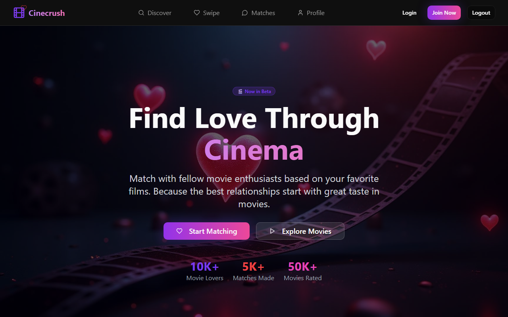
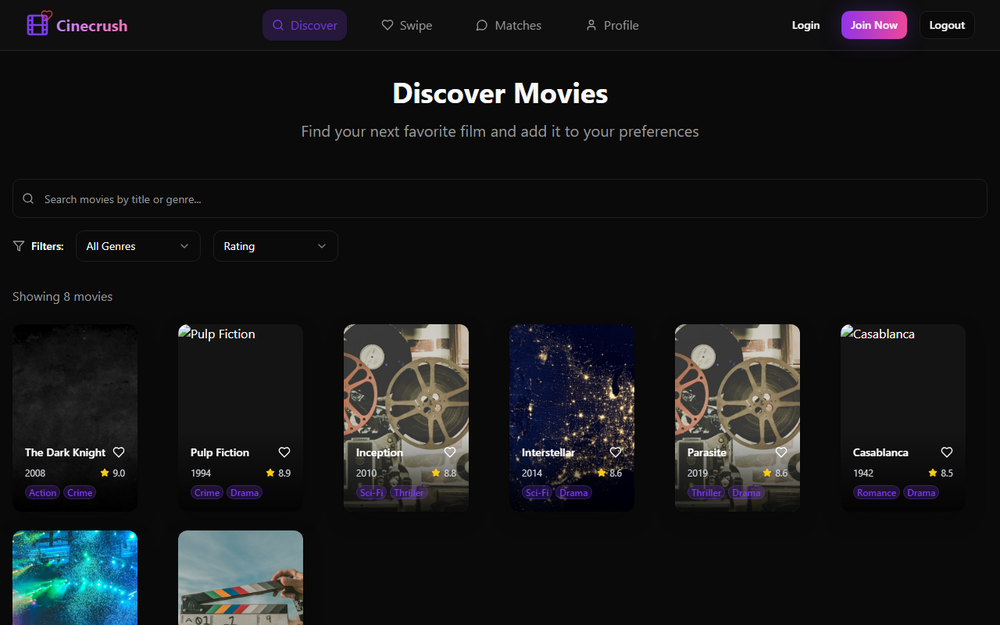
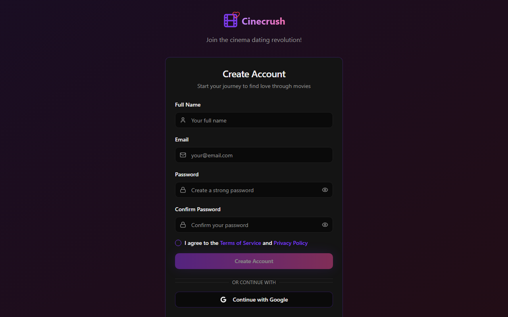

<div align="center">

# 🎬 Cinecrush

**Film zevkine göre eşleş, sohbet et, birlikte izleyeceğin filmi keşfet**


### 🔗 [**Canlı Demo → cinecrush-phi.vercel.app**](https://cinecrush-phi.vercel.app)

</div>

---

## 📋 Hakkında

Cinecrush; film zevkini sosyal bir deneyime dönüştüren bir **eşleşme ve keşif** uygulamasıdır. Filmleri kaydır (swipe), benzer zevklere sahip kişilerle eşleş, sohbet et ve birlikte izleyeceğin yapımları keşfet.

## 📸 Ekran Görüntüleri

| Ana Sayfa | Keşfet | Kayıt Ol |
|:---:|:---:|:---:|
|  |  |  |

## ✨ Özellikler

- **Swipe & Eşleşme** — Filmleri ve kullanıcıları kaydırarak keşfet
- **Film keşfi** — Detaylı film sayfaları ve öneriler
- **Eşleşmeler** — Ortak zevke sahip kullanıcılarla bağlantı
- **Sohbet** — Eşleşmelerle gerçek zamanlı mesajlaşma
- **Profil** — Kişisel film tercihleri ve profil yönetimi

## 🛠️ Teknoloji Yığını

| Katman | Teknolojiler |
|--------|--------------|
| Arayüz | React 18, TypeScript, Tailwind CSS, shadcn/ui |
| Build | Vite |
| Veri & Kimlik | Firebase (Auth, Firestore) |
| Yönlendirme | React Router |

## 🚀 Kurulum

```bash
# Bağımlılıkları yükleyin
npm install

# Geliştirme sunucusunu başlatın (sıfır yapılandırma — Firebase ve film API'si hazır)
npm run dev

# Production build
npm run build
```

> İsteğe bağlı: Kendi OMDb API anahtarınızı kullanmak için `.env` dosyasına
> `VITE_OMDB_API_KEY=...` ekleyebilirsiniz. Belirtilmezse gömülü demo anahtarı kullanılır.

## 👤 Geliştirici

**Emir Tiryaki** — Full Stack Developer
🌐 [emirtiryaki.com](https://emirtiryaki.com) · 📧 info@emirtiryaki.com

## 📄 Lisans

MIT © Emir Tiryaki
